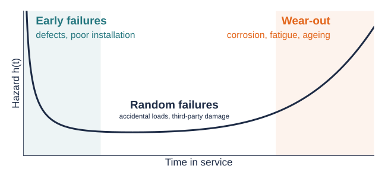
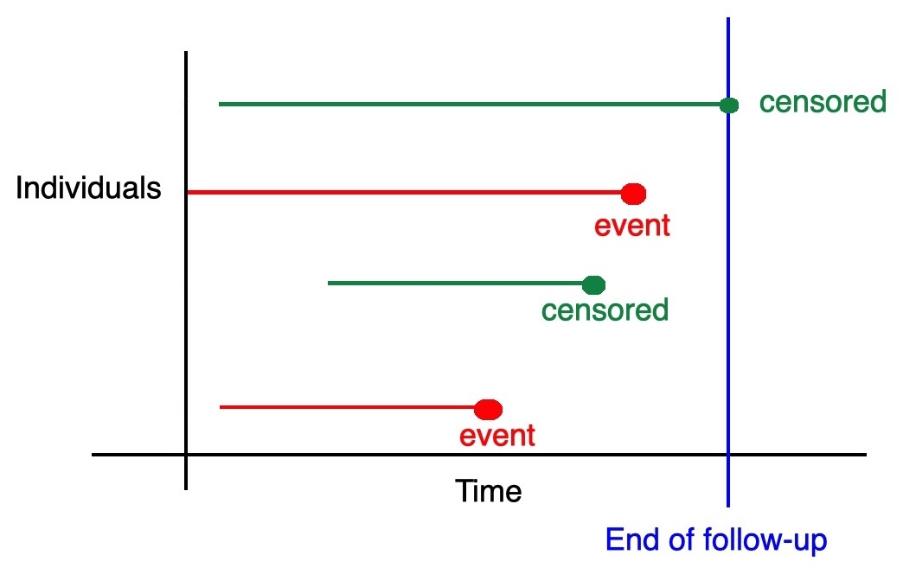
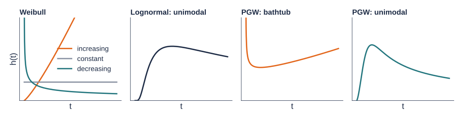

## By the end of this session you should be able to

::: incremental
- Recognise **time-to-event data** in engineering problems and explain why **censoring** needs special treatment.
- Define the **survival** and **hazard** functions and interpret common hazard shapes.
- Describe how covariates enter hazard models: **proportional hazards (PH)**, **accelerated failure time (AFT)**, **accelerated hazards (AH)**, and the **general hazard (GH)** structure that unifies them.
- Outline how parametric hazard models are fitted and compared, and where to find software.
:::

::: notes
~1 min. Frame the session as an overview: the aim is vocabulary and intuition, not derivations.
:::

## Time-to-event data are everywhere

Survival analysis is used in medicine, epidemiology, genetics, biology, and **engineering**, where it is usually called **reliability analysis**. The mathematics is the same.

:::: {.columns}
::: {.column width="50%" .fragment .fade-up}
### In civil engineering

- Time until a **water main** bursts
- Time until **pavement cracking** reaches an intervention threshold
- Time to **corrosion initiation** in reinforced concrete
- Load cycles until a **fatigue crack** appears in a welded joint
:::

::: {.column width="50%" .fragment .fade-up}
### The common thread

The outcome is a **duration**: how long until something happens.

We rarely observe every failure. Some assets are still in service when we stop watching.
:::
::::

::: notes
~2 min. Ask the class for one more example from their own modules (e.g. bridge bearings, geotextile degradation).
:::

## The survival function

$$
S(t) = P(T > t)
$$

The probability that a component is **still working beyond time $t$**.

::: incremental
- $S(0) = 1$ and $S(t)$ decreases as $t$ grows.
- Answers questions such as: *what proportion of our pipes will still be in service after 50 years?*
- It tells us **how many** survive, but not **how the risk of failure changes over time**. For that we need the hazard.
:::

::: notes
~1.5 min.
:::

## The hazard function


Assets are exposed to many **forces of failure**: ageing, corrosion, fatigue, overloading, floods, accidental damage...

::: {.fragment .fade-up}
The hazard quantifies these forces **at each time point $t > 0$**, among the items that have survived so far [@rinne2014]:

$$
h(t) = \lim_{dt \to 0} \frac{P(t \le T < t + dt \mid T \ge t)}{dt} = \frac{f_T(t)}{S_T(t)},
$$

where $f_T(t)$ is the probability density function of $T$. **Instantaneous Failure Rate**

:::

::: {.fragment .fade-up}
::: {.box}
[Homework (suggested)]{.box-title}

Show that $h(t) = f_T(t)/S_T(t)$. Then show that $S_T(t) = \exp\{-H(t)\}$, where $H(t) = \int_0^t h(u)\,du$ is the **cumulative hazard**.
:::
:::


::: notes
~3 min. Intuition: h(t)dt is approximately the chance of failing in the next small interval, given that the item has lasted until t. Engineers may know it as the "failure rate".
:::

## The shape of the hazard tells a story

{fig-align="center" width="92%"}

The classic **bathtub curve**: different mechanisms dominate at different stages of an asset's life. Estimating the hazard shape from data helps decide *when* to inspect, maintain, or replace.

::: notes
~2 min. Many students will have seen this curve before. Emphasise that a survival curve alone would hide these three regimes.
:::

## The typical data set

:::: {.columns}
::: {.column width="48%"}
- **Times to event** $t_1, \dots, t_n$ (possibly right-censored).
- **Status indicators** $\delta_1, \dots, \delta_n$:
  - [$\delta_i = 1$]{.fail}: failure observed
  - [$\delta_i = 0$]{.cens}: right-censored, still in service

Censoring can be due to the **end of the study period**, an asset **removed for other reasons** (e.g. road realignment), or **lost records**.
:::

::: {.column width="52%"}
{width="76%"}

::: {.fragment .fade-up}
::: {.box .warn}
[Don't throw censored items away]{.box-title}

Dropping them, or treating them as failures, biases lifetime estimates. A censored item still tells us it **survived at least** until $t_i$.
:::
:::
:::
::::

::: notes
~3 min.
:::

## Adding covariates

We often know more about each item: covariates $\mathbf{x}_i = (x_{i1}, \dots, x_{ip})^\top$.

| Covariate | Example |
|:----------|:--------|
| Material | cast iron, ductile iron, PVC |
| Geometry | pipe diameter, slab thickness |
| Environment | soil corrosivity, freeze–thaw cycles |
| Loading | traffic volume, operating pressure |

::: {.fragment}
**The key question:** how should covariates change the hazard function?
:::

::: notes
~1 min. Transition to the three classical answers.
:::

## Three classical answers

:::: {.columns}

::: {.column width="31%" .model-col}
### PH
::: {.fragment .fade-up}
Covariates **multiply the hazard**.

::: eq
$$h(t \mid \mathbf{x}) = h_0(t)\, e^{\mathbf{x}^\top\beta}$$
:::

The hazard ratio $e^{\beta}$ is the same at every time.
:::
:::

::: {.column width="3%"}
:::

::: {.column width="31%" .model-col}
### AFT

::: {.fragment .fade-up}
Covariates **speed up or slow down time** for the whole lifetime.

::: eq
$$
\begin{aligned}
S(t \mid \mathbf{x}) &= S_0\!\left(t\, e^{\mathbf{x}^\top\beta}\right) \\
h(t \mid \mathbf{x}) &= h_0\!\left(t\, e^{\mathbf{x}^\top\beta}\right) e^{\mathbf{x}^\top\beta}
\end{aligned}
$$
:::

The idea behind **accelerated life testing**: harsh conditions make a component "age" faster.
:::
:::

::: {.column width="3%"}
:::

::: {.column width="31%" .model-col}
### AH

::: {.fragment .fade-up}
Covariates **rescale time inside the hazard** only.

::: eq
$$h(t \mid \mathbf{x}) = h_0\!\left(t\, e^{\mathbf{x}^\top\alpha}\right)$$
:::

Shifts *when* the risk peaks, without changing its height.
:::
:::
::::

<br>

Here $h_0$ and $S_0$ are the **baseline** hazard and survival functions (all covariates equal to zero).

::: notes
~3 min. The AFT connection is the one engineers find most natural.
:::
## The general hazard (GH) structure

@etezadi1987 and @chen2001 proposed a natural structure that contains all three:

$$
\begin{aligned}
h(t \mid \mathbf{x}) &= h_0\!\left(t\, e^{\tilde{\mathbf{x}}^\top\alpha}\right) e^{\mathbf{x}^\top\beta}, \\
H(t \mid \mathbf{x}) &= H_0\!\left(t\, e^{\tilde{\mathbf{x}}^\top\alpha}\right) e^{\mathbf{x}^\top\beta - \tilde{\mathbf{x}}^\top\alpha},
\end{aligned}
\qquad \tilde{\mathbf{x}} \subseteq \mathbf{x}.
$$

:::: {.columns}
::: {.column width="55%" .fragment .fade-up}
| Constraint | Model |
|:-----------|:------|
| $\alpha = 0$ | PH |
| $\beta = 0$ | AH |
| $\alpha = \beta$ (with $\tilde{\mathbf{x}} = \mathbf{x}$) | AFT |
:::

::: {.column width="45%" .small .fragment .fade-up}
- $\tilde{\mathbf{x}}$: **time-level** effects, through $\alpha$.
- $\mathbf{x}$: **hazard-level** effects, through $\beta$.
- Identifiable unless the baseline is **Weibull**, where PH, AFT and AH coincide [@chen2001].
- Widely used in applications [@rubio2019].
:::
::::

::: notes
~3 min. The next slides let you see what alpha and beta do.
:::

```{ojs}
//| echo: false
//| output: false
// Shared helpers for the interactive slides.
// Baseline: log-logistic with scale lam and shape k (unimodal hazard, not Weibull).
hz = {
  const lam = 2, k = 3;
  const h0 = t => (k / lam) * Math.pow(t / lam, k - 1) / (1 + Math.pow(t / lam, k));
  const H0 = t => Math.log(1 + Math.pow(t / lam, k));
  const grid = d3.range(0.01, 8.001, 0.04);
  const curves = (a, b) => grid.map(t => ({
    t,
    h: h0(t * Math.exp(a)) * Math.exp(b),
    S: Math.exp(-H0(t * Math.exp(a)) * Math.exp(b - a))
  }));
  return {grid, curves};
}
```

```{ojs}
//| echo: false
//| output: false
function hazPanels(a, b, hmax) {
  const base = hz.curves(0, 0);
  const cov  = hz.curves(a, b);
  const common = {
    width: 540, height: 340, marginLeft: 58, marginTop: 34, marginBottom: 48,
    style: {fontFamily: "IBM Plex Sans, sans-serif", fontSize: "17px",
            background: "transparent", color: "#1D2B45"},
    x: {label: "Time in service, t", domain: [0, 8], labelAnchor: "center"}
  };
  const refLine = y => Plot.line(base, {x: "t", y, stroke: "#8A93A3",
                                         strokeWidth: 2.5, strokeDasharray: "7,6"});
  const covLine = y => Plot.line(cov,  {x: "t", y, stroke: "#E3661B",
                                         strokeWidth: 4, clip: true});
  const pH = Plot.plot({...common,
    y: {label: "Hazard h(t)", domain: [0, hmax], grid: true},
    marks: [refLine("h"), covLine("h"), Plot.ruleY([0])]});
  const pS = Plot.plot({...common,
    y: {label: "Survival S(t)", domain: [0, 1], grid: true},
    marks: [refLine("S"), covLine("S"), Plot.ruleY([0])]});
  return html`<div class="hz-panels">${pH}${pS}</div>`;
}
```

```{ojs}
//| echo: false
//| output: false
legend = () => html`<div class="legend">
  <span><span class="swatch ref"></span>reference item (x = 0)</span>
  <span><span class="swatch cov"></span>item with x = 1 (e.g. corrosive soil)</span>
</div>`
```

## Time-level effects: what $\alpha$ does

Set $\beta = 0$ (the AH model) and move $\alpha$. The covariate changes **the clock inside the hazard**.

```{ojs}
//| echo: false
viewof a1 = Inputs.range([-1, 1], {value: 0.6, step: 0.05, label: "α"})
```

```{ojs}
//| echo: false
hazPanels(a1, 0, 1.2)
```

```{ojs}
//| echo: false
html`<div class="hz-readout">e<sup>α</sup> = <strong>${Math.exp(a1).toFixed(2)}</strong>: the peak risk arrives ${a1 > 0 ? "earlier" : a1 < 0 ? "later" : "at the same time"}, with the same height.</div>`
```

```{ojs}
//| echo: false
legend()
```

::: notes
~1.5 min. Replaces the original animation. Try alpha = 0.6 then -0.6.
:::

## Hazard-level effects: what $\beta$ does

Set $\alpha = 0$ (the PH model) and move $\beta$. The covariate **scales the hazard up or down** at every time.

```{ojs}
//| echo: false
viewof b2 = Inputs.range([-1, 1.2], {value: 0.7, step: 0.05, label: "β"})
```

```{ojs}
//| echo: false
hazPanels(0, b2, 2.8)
```

```{ojs}
//| echo: false
html`<div class="hz-readout">Hazard ratio e<sup>β</sup> = <strong>${Math.exp(b2).toFixed(2)}</strong> at every time point; the peak stays at the same time.</div>`
```

```{ojs}
//| echo: false
legend()
```

::: notes
~1.5 min. Replaces the original animation.
:::

## Explore: the whole GH family

:::: {.hz-controls}
```{ojs}
//| echo: false
viewof a3 = Inputs.range([-1, 1], {value: 0.5, step: 0.05, label: "α"})
```

```{ojs}
//| echo: false
viewof b3 = Inputs.range([-1, 1.2], {value: 0.5, step: 0.05, label: "β"})
```
::::

```{ojs}
//| echo: false
//| output: false
modelName = {
  const eq = (u, v) => Math.abs(u - v) < 1e-9;
  if (eq(a3, 0) && eq(b3, 0)) return ["Baseline", "no covariate effect"];
  if (eq(a3, 0)) return ["PH", "α = 0"];
  if (eq(b3, 0)) return ["AH", "β = 0"];
  if (eq(a3, b3)) return ["AFT", "α = β"];
  return ["GH", "general case"];
}
```

```{ojs}
//| echo: false
html`<div class="hz-readout"><span class="model-tag">${modelName[0]}</span>${modelName[1]}</div>`
```

```{ojs}
//| echo: false
hazPanels(a3, b3, 2.8)
```

```{ojs}
//| echo: false
legend()
```

::: notes
~1 min, optional. Set alpha = beta to show AFT: the survival curve is stretched horizontally.
:::

## Fitting parametric GH models

::: incremental
1. **Choose a parametric baseline** $h_0(\cdot\,; \theta)$, e.g. lognormal, log-logistic, gamma, generalised gamma, power generalised Weibull (PGW).
2. **Write the likelihood.** Failures and censored items both contribute:
   $$
   L(\theta, \alpha, \beta) = \prod_{i=1}^n h(t_i \mid \mathbf{x}_i)^{\delta_i}\, S(t_i \mid \mathbf{x}_i).
   $$
3. **Maximise it** to obtain maximum likelihood estimates.
4. **Compare candidate models** (baseline × PH / AFT / AH / GH) using AIC or BIC.
:::

::: {.fragment}
Software: the **HazReg** packages for [R](TODO-LINK-HAZREG-R) and [Julia](TODO-LINK-HAZREG-JULIA).
:::

::: notes
~2 min. Point out that censored items enter through S(t_i): this is how censoring is "used, not discarded".
:::

## Choosing a baseline hazard

A brief catalogue: [Gamma](https://en.wikipedia.org/wiki/Gamma_distribution), [Weibull](https://en.wikipedia.org/wiki/Weibull_distribution), [Lognormal](https://en.wikipedia.org/wiki/Log-normal_distribution), [Log-logistic](https://en.wikipedia.org/wiki/Log-logistic_distribution), [Generalised gamma](https://en.wikipedia.org/wiki/Generalized_gamma_distribution), [PGW](https://rpubs.com/FJRubio/PGW), [EW](https://rpubs.com/FJRubio/EWD), among many others.

{fig-align="center" width="100%"}

::: notes
~1.5 min.
:::

## Baseline choice is an assumption

::: {.box .warn}
[Warning]{.box-title}

By picking a distribution from the catalogue, we restrict the **hazard shapes** the model can represent. A Weibull model can never produce a bathtub curve, however much data we collect.
:::

::: {.fragment .fade-up}
| Distribution | Hazard shapes it can capture |
|:-------------|:-----------------------------|
| Weibull | increasing, decreasing, constant |
| Lognormal, log-logistic | unimodal (up then down) |
| Generalised gamma, PGW, EW | increasing, decreasing, bathtub, unimodal |
:::

::: {.fragment .fade-up}
Fit several candidates and select with **AIC** $= 2k - 2\log \hat{L}$ or **BIC** $= k \log n - 2 \log \hat{L}$ (smaller is better; $k$ = number of parameters). Then check the selected model makes engineering sense.
:::


::: notes
~1 min.
:::

## Real data example

- The **LeukSurv** data set from the R package *spBayesSurv*: survival of acute myeloid leukaemia in 1,043 patients.
- We fit **GH, PH, AFT and AH** models with different baselines and select the best using **AIC and BIC**.
- We summarise the selected model with the tools in the **HazReg** R package.

[Open the worked example](https://fjrubio-hazreg.share.connect.posit.cloud/){.app-link target="_blank"}

::: {.box}
[Think about it]{.box-title}

The workflow is identical for engineering data. For a water-main failure record, which covariates might act at the **time level** ($\tilde{\mathbf{x}}$) and which at the **hazard level** ($\mathbf{x}$)?
:::

::: notes
~3 min, live demo in the browser.
:::

## Key takeaways

::: incremental
- Time-to-event data appear throughout engineering; **censoring** is the norm, not the exception.
- The **hazard function** describes how the risk of failure evolves; its shape carries physical meaning.
- Covariates can act on the **hazard level** (PH), the **time scale** (AFT, AH), or both (**GH**).
- Parametric baselines make assumptions about hazard shapes: **compare models formally**.
:::

## References {.refs}

::: {#refs}
:::
